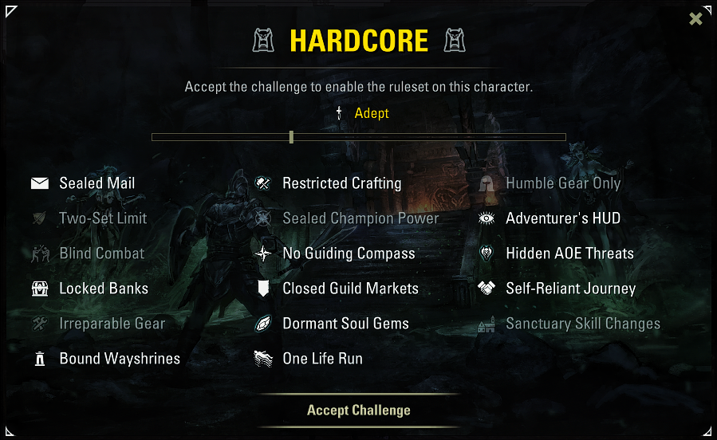

# HARDCORE

HARDCORE adds a punishing, modular challenge layer to Elder Scrolls Online. It is built for players who want a harsher overland journey, with optional rules that restrict outside help, reduce UI information, and force a more self-reliant run.

The goal is simple: reach level 50 on a brand new character without dying.

To keep the challenge fair and functional, do not use custom UI health bars such as LUI, Bandits UI, or AUI. HARDCORE relies on the default ESO UI to hide information and trigger visual cues. Moving the default bars with another addon is fine, but replacing them may break the addon logic.

## Feats System

Feats are optional, permanent challenges that can be accepted during a Hardcore run. Once accepted, a feat cannot be deactivated for that run. Each feat has its own difficulty rating and adds a specific survival constraint or failure condition.

Available feats:

- **Road Weariness**: Travel, stamina loss, and battle wear you down. Sit, sleep, or use furniture to rest before exhaustion makes weapons and NPCs slip out of reach.
- **Trail Rations**: Hunger and thirst drain as the road stretches on. Keep food and drink in your pack, or starvation will dim the world around you.
- **No Swimming**: Deep water gives you fifteen seconds of mercy. Keep swimming after the timer runs dry and the challenge ends.
- **No Potions**: Drink a potion and the run ends. No emergency bottle, no alchemist's mercy.
- **Barbarian**: Live by the great weapon: only two-handed axes, hammers, and swords may stay equipped. Head and chest stay bare; all other armor must be heavy.
- **Nudist**: Armor slots must stay bare: no helm, chest, shoulders, gloves, belt, legs, or boots. Weapons and jewelry are still allowed.
- **Self Made**: Only gear crafted by your own hands may stay equipped. Equipment-crafting stations are allowed for making your kit.
- **Lockpick Nerves**: Each failed or broken pick leaves a panic mark for ten seconds. Three marks break your nerve and end the run; a clean lock steadies your hands.
- **Hands Free**: Weapons are off the table. Improvise, punch, dodge, pray, or discover how persuasive empty hands can be.
- **Need of Blood**: Every ten minutes, the blood demand wakes. Only kills during its twenty-second window count; fail to feed it and the run ends.
- **Mandatory Bath Time**: Every fifteen minutes, the bath bell tolls. Enter water and soak for ten seconds, or the short grace countdown ends the run.
- **Silent Pilgrim**: You have taken a vow of silence: no talking to NPCs, no quest chatter, no turn-ins. Dialogue is closed before a single word leaves your mouth.
- **No Map**: The road must be remembered, not drawn.

## The Rules

- **One Life Run**: The ultimate challenge. Death means the end of the run.
- **Sealed Mail**: You cannot send or receive mail.
- **Restricted Crafting**: Your focus is survival. Only Alchemy and Provisioning are permitted.
- **Humble Gear Only**: You are limited to simple gear of White or Green quality.
- **Two-Set Limit**: You can only wear two items from the same set, preventing powerful set bonuses.
- **Sealed Champion Power**: Champion Point usage is disabled.
- **Adventurer's HUD**: Your health bar is hidden. As you take damage, your vision dims and narrows. Action bars are hidden and only reveal themselves briefly.
- **Blind Combat**: Enemies have no names, health bars, or target frames. You must watch their animations to judge the fight.
- **No Guiding Compass**: The compass is disabled, removing markers and directional guidance.
- **Hidden AOE Threats**: Enemy area attacks leave no ground telegraphs.
- **Locked Banks**: Bank access is completely restricted.
- **Closed Guild Markets**: Guild Traders cannot be used.
- **Self-Reliant Journey**: Direct trading with other players is disabled.
- **Irreparable Gear**: Equipment cannot be repaired. Once it breaks, it must be replaced.
- **Dormant Soul Gems**: Soul gems cannot be used to restore weapon charges.
- **Sanctuary Skill Changes**: Skills and morphs can only be adjusted in towns and safe settlements.
- **Bound Wayshrines**: Fast travel is restricted to traveling from one Wayshrine to another.

## Dependencies

- [LibAddonMenu-2.0 r41 or newer](https://www.esoui.com/downloads/info7-libaddonmenu.html)
